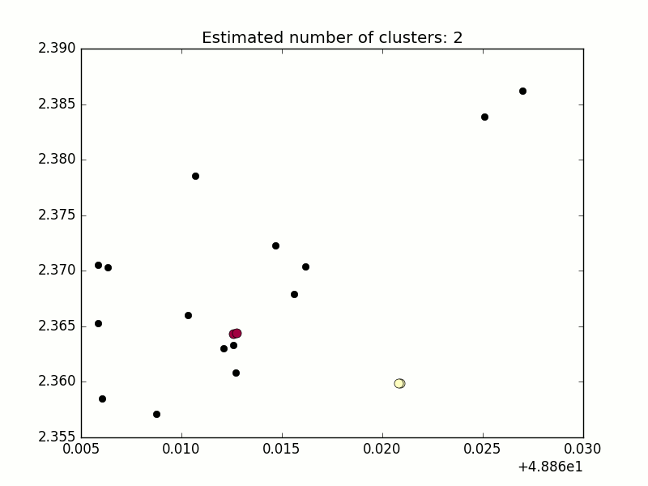

### Installation

- Setup environment

```
virtualenv venv
source venv/bin/activate
pip install -r requirements.txt
```

- Download the data

```
mkdir data
mkdir images
```

Download the file into the `data` folder

Then run the program :

```
python run.py
```

The output will be the number of cluster found at each second, and the event (json format) at every change.

Example

```json
{
    "type": "decrease",
    "date": 2,
    "centroid": (1.0, 1.0),
    "people_out": set([17]),
    "previous_cluster_id": 15,
    "cluster_id": 16,
    "population": set([16, 15]),
    "density": 0.0
}
```

If you change the value of the variable `PLOT` in `run.py`, you will have the plot of each step (with colored clusters) in the folder `images`.

To run the tests :

```
nosetests --rednose --force-color tests/
```


- IPython Notebook

You can browse the file `exploration.ipynb` which explain the choice of some variables. (PS: The first graph doesn't seem to work)

### Main goal

The main goal of this project is to detect groups creation/modification/deletion on temporal and geo-spatial data.

### Problematics

#### The Accuracy of the data

Each position comes with an accuracy which can be very low (high value in meters of imprecision). We then face multiple problems :

- Distance metric
- Shape computation
- Centroid localization

#### The sampling of the data

The series of points for a user is not regularly sampled and like the accuracy there can be long moment (many hours) between two points. We have to :

- Handle time series with big gaps (cut in multiple parts)
- Predict the short term position when the gap is reasonable (we can use the information of the past trajectory)

#### The clustering

The main problem is to group people without knowing the number of group. We can only use the repartition of the points (and its evolutions) to extract this information.

### Approach

#### Sampling and accuracy

- Discard the outliers
    - Using the `exploration.ipynb`, we chose 60 meters as a minimum viable accuracy
    - We also removed series with elapsed time > 1 minute

- Stationary interpolation of the position if the last position was less than 1 minute before

With this interpolation, we can re-use the series we removed earlier : if no point was detected for 1 minute, the algorithm will not consider it.

#### Clustering

Unsupervised algorithm to cluster people based on their closeness :

- We do not want to put everyone in a cluster
- The cluster must be very dense
- The number `k` of clusters can change every second

We used the [DBSCAN](https://www.wikiwand.com/en/DBSCAN) algorithm for multiple reasons and mainly for its weaknesses :

- Handle only regularly dense clusters
- Comes with the parameter `epsilon` which defines the maximum distance between two samples
- Is less effective with high dimensional problems

See [A Review: Comparative Study of Various Clustering Techniques in Data Mining](https://pdfs.semanticscholar.org/337b/a3775d45858243889d9f638567b849e446d5.pdf) (short and precise)

Distance metric :

We chose a distance metric that could be easily understandable, to be able to choose the best epsilon for DBSCAN.

- First we used the [Haversine](https://www.wikiwand.com/en/Haversine_formula) formula between two points
- Then if the accuracy was very low, we weighted it by using the max and min distances possible between points

### Results

#### Parameters

The only parameters would be the accuracy filter and the epsilon of DBSCAN. The latter is easy to choose when there are no accuracy problems : because we used the Haversine distance, we can reasonably select a minimum distance between two people in the same groups (for instance 4 meters). With the accuracy, we chose 50 meters empirically.

Moreover the sparse positions in the dataset allow us to be less strict on the minimum distance between dots.

#### Screenshot

Here is an example group evolutions :



There is also a video of the first evolutions :


### To be done (short term)

- Validate group modification only if a certain amount of time has passed (sample not just passing through)
- Enhance accuracy handling in distance metric
- Better graphical output
- Bug fixing / Refacto

### Future work

#### Trajectories

- The density of the accuracy circle could be higher in the point 'global' direction. It would change the distance computation. We could use the [Ramer-Douglas-Peucker](https://www.wikiwand.com/en/Ramer%E2%80%93Douglas%E2%80%93Peucker_algorithm) algorithm to extract the general path of the point.
- Could be use have a better interpolation.

#### Contextual informations

- [Density-based Place Clustering in Geo-Social Networks](http://i.cs.hku.hk/~nikos/sigmod14.pdf)
- [Ad-Hoc Group Formation/Detection for Better Shopping Experience](http://www.ijeit.com/vol%202/Issue%205/IJEIT1412201211_04.pdf)
- [Jasmine: A Real-time Local-event Detection System based on Geolocation Information Propagated to Microblogs](https://pdfs.semanticscholar.org/ecc1/3be3e07f8f1c74c5212d576374abbb355f38.pdf)
- [Social Event Detection in Massive Mobile Phone Data Using Probabilistic Location Inference](https://hal.inria.fr/file/index/docid/627122/filename/socialcom_2011.pdf)

#### Graphical

- Add circle of the size of the accuracy with a corresponding `alpha`
- Add the map of Paris

#### Handle mobility

- [Group Detection in Mobility Traces](https://pdfs.semanticscholar.org/0b1d/d3f9411b595f5f75e365b175479866ed93bc.pdf)

### Bibliography / Sources / To read

- [ST-DBSCAN: An algorithm for clustering spatial–temporal data (2006)](http://kt.ijs.si/markodebeljak/Lectures/Seminar_MPS/2012_on/Seminars_2015_16/Matej%20Senozetnik/Matej%20Senozetnik%20references/Birant,%20ST-DBSCAN%20An%20algorithm%20for%20clustering.pdf)
- [Ramer–Douglas–Peucker algorithm implementation](https://github.com/sebleier/RDP)
- [Limits of Predictability in Human Mobility](https://zehui.yolasite.com/resources/Limits%20of%20Predictability%20in%20Human%20Mobility.pdf)